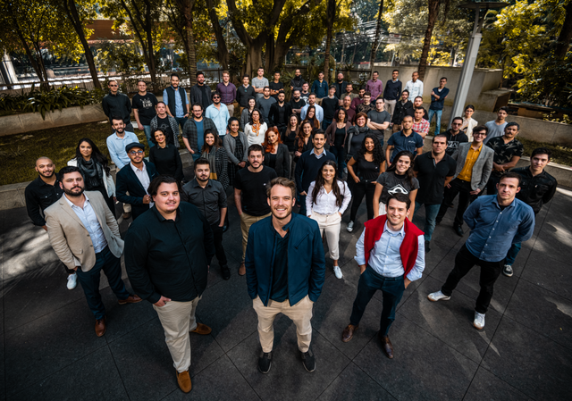

```{r setup, include=FALSE}
knitr::opts_chunk$set(echo = TRUE)
```

```{r, include=FALSE, echo=FALSE, message=FALSE}
library(tidyverse)
library(readxl)
library(knitr)
library(DT)
brasil_paralelo <- read_xlsx("./brasil_paralelo_15_10_22.xls")
```

# Objetivo do projeto:

O presente projeto foi idealizado com o intuito de apresentar uma breve apresentação dos vídeos produzidos e disponibilizados no YouTube pela produtora de conteúdo cultural em formato digital [Brasil Paralelo](https://www.youtube.com/c/BrasilParaleloOficial), durante o ano de 2022. Apresentando assim, as principais temáticas veiculadas nos 10 primeiros vídeos que combinem o maior número de comentários e likes, métricas relacionadas ao engajamento do espectador com o conteúdo. 

A escolha deste objeto de análise se dá com base na minha atual pesquisa de mestrado, vigente no [programa de pós-graduação em ciências sociais da Universidade Federal da Bahia](https://ppgcs.ufba.br/) (PPGCS/UFBA).

Ademais, o trabalho é requisito obrigatório para a formação no curso de Ciências de Dados I, da [Curso R](https://curso-r.com/).


# Brasil Paralelo:

A Brasil Paralelo é uma produtora de conteúdo audivisual, os quais são disponibilizados em sua plataforma fechada [site](https://www.brasilparalelo.com.br/), plataforma de [*streaming*](https://site.brasilparalelo.com.br/seja-membro/filmes/), pelo seu [aplicativo](https://play.google.com/store/apps/details?id=com.brasilparalelo.athena&hl=pt) e finalmente, disponibilizado gratuitamente em seu canal do [YouTube](https://www.youtube.com/c/BrasilParaleloOficial).


A empresa foi fundada em junho de 2016 em Porto Alegre - RS, em meio a profusão da crise política em que o Brasil estava (e está) inserido, seguido pelos protestos de 2013 e o *impeachment*/golpe da presidenta Dilma Roussef(PT). 

Tendo como principais fundadores, o trio: Lucas Ferrugem, Felipe Valerim e Henrique Viana (fig.1), três jovens de pouco menos de 30 anos à época, que se viram investidos da responsabilidade de ingressar em um projeto de educação cultural, e mostrar ao Brasil a sua verdadeira face "paralela", há tanto tempo escondida. 

Com o intuito de "resgatar os bons valores e sentimentos no povo brasileiro", a empresa, entretanto, se utiliza de revisionismo histórico, e desta forma, desfiguram eventos da história do Brasil, já consolidados, como a Ditadura Militar e o período Imperial, confrontando a historiografia oficial e apresentado uma cosmovisão da extrema-direita, em sintonia com o projeto de poder bolsonarista no Brasil. 


```{r, include=TRUE, error=FALSE, message=FALSE, echo=FALSE, fig.align='center',  fig.cap="fig.1: Equipe Brasil Paralelo, 2021"}
imagem_equipe <- 

imagem_equipe
```


# Base de dados:

A base utilizada para essa demonstração foi extraída da API do YouTube com a ajuda do software [Youtube Data Tools](https://tools.digitalmethods.net/netvizz/youtube/index.php), a ferramenta foi desenvolvida pela [Digital Methods Iniciative](https://wiki.digitalmethods.net/), iniciativa vinculada a  Universidade de Amsterdã.


A partir do Youtube Data Tools, foi possível extrair os metadados dos vídeos do canal da produtora, utilizando como princípio um fragmento do endereço do canal. Assim, foi reconstituída uma base com 2.012 linhas, com número idêntico de vídeos, os vídeos e métricas são referentes ao dia 15/10/2022.


```{r, message=FALSE, echo=FALSE}
amostra <- glimpse(brasil_paralelo)
```


# Operações na base:


```{r, echo=FALSE}

#operação para separar a coluna data de publicação em data e hora:

separate_1 <- brasil_paralelo |> 
  separate(col = data_de_publicação, into = c("data", "hora"), " ")

#operação para separar a coluna data em ano, mês e dia, para assim poder filtrar o ano:
videos_bp_2022 <- separate_1 |> 
  separate(col = data, into = c("ano", "mês", "dia"), sep = "-") |> 
  filter(ano == 2022) |> 
  view()

```


A partir das operações realizadas na base com o intuito de filtrar os vídeos correspondentes ao ano de 2022, restaram 1.215 vídeos levando em consideração que o canal disponibiliza vídeos desde 2016 e a base inicial continha 2,012 linhas/vídeos.

```{r, echo=FALSE}
glimpse(videos_bp_2022)

```

# Métricas dos vídeos:

```{r, echo=FALSE}

videos_bp_2022 |>
  select(títulos, mês, ano, comentários, likes, categorias) |>
  arrange(desc(comentários), desc(likes)) |>
  datatable()
  
```


# Resultados:

A partir da breve análise exposta podemos concluir que grande parte dos temas mobilizados que tiveram maior indíce de engajmento em 2022 nos 10 vídeos analisados do Brasil Paralelo, tiveram como preferência temáticas conspiratórias e alinhadas com as ditas "pautas morais", temas que mobilizam o pânico moral do público de vertente conservadora, com base na ideia de que os valores tradicionais estão sendo corrompidos e a sociedade está em via de colapso por conta desta degeneração, que culmina em argumentos que mobilizam a homofobia, anticomunismo, sexismo e até racismo.  

Essas ideias estão presentes nos vídeos sobre doutrinação ideológica nas escolas, fim da beleza e mídia e defesa de bandidos, além das ideias defendidas por Olavo de Carvalho, autoproclamado filósofo e articulador da extrema-direita no Brasil (falecido em janeiro desse ano).

De forma geral, a Brasil Paralelo apresenta nas suas produções a tendência de contestar pareceres científicos, como o consenso em relação ao aquecimento global e apresentar teses conspiracionistas, que argumentam sobre a ação perniciosa de Ongs junto a partidos políticos de esquerda. 

Ademais, visando a vigência do ano eleitoral, está também presente entre as produções mais engajadas no ano de 2022, produções que dizem respeito a ataques direcionados ao PT (partido dos trabalhadores), principal opositor do governo Bolsonaro, com o qual a Brasil Paralelo apresentou afinidades e articulou [parcerias](https://educacao.estadao.com.br/noticias/geral,tv-do-mec-vai-exibir-serie-que-promete-resgate-historico-e-entrevista-olavo-de-carvalho,70003119766).

Por fim, as demais temáticas presentes se relacionam a temas polêmicos, que se destacam para o público em razão das controvérsias geradas.


### Referências:

PARALELO, B. Equipe de profissionais da Brasil Paralelo. , 21 jun. 2021. Disponível em: <https://commons.wikimedia.org/wiki/File:Brasil_Paralelo_-_Equipe_(51260760937).png>. Acesso em: 17 out. 2022
TV ligada ao MEC vai exibir série que promete “resgate histórico” e entrevista Olavo de Carvalho - Educação. Disponível em: <https://educacao.estadao.com.br/noticias/geral,tv-do-mec-vai-exibir-serie-que-promete-resgate-historico-e-entrevista-olavo-de-carvalho,70003119766>. Acesso em: 17 out. 2022. 
YouTube Data Tools. Disponível em: <https://tools.digitalmethods.net/netvizz/youtube/>. Acesso em: 17 out. 2022. 


